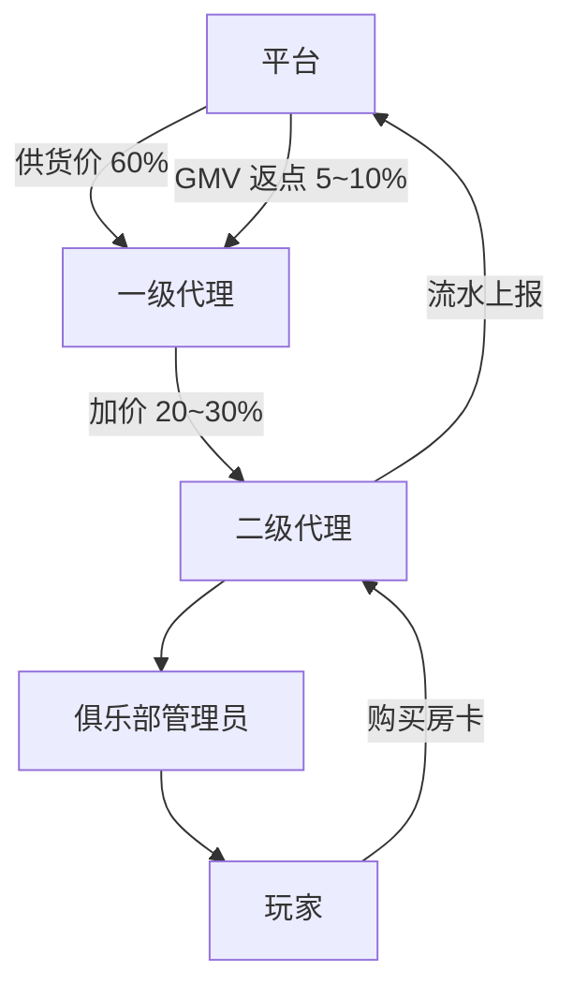

# 代理与俱乐部体系

> 房卡场地推运营核心。经济基线见 [platform/economy-base.md](../../platform/economy-base.md)。

---

## 1. 渠道架构



---

## 2. 角色定义与职责

| 角色 | 职责 | 收益方式 |
| :--- | :--- | :--- |
| **一级代理** | 区域独家地推、俱乐部孵化、管理二级代理 | 60% 供货价 + GMV 返点 5~10% |
| **二级代理** | 向玩家/小俱乐部销售房卡 | 零售价与供货价差价（20~30%） |
| **俱乐部管理员** | 建群、组局、代充房卡、成员管理 | 流水返点 3~5%（仅房卡 GMV） |
| **玩家** | 参与游戏、购买房卡 | — |

---

## 3. 分成规则

| 规则项 | 参数 | 说明 |
| :--- | :--- | :--- |
| 一级代理供货价 | 零售价的 60% | 例：6 元房卡包，供货价 3.6 元 |
| 一级代理 GMV 返点 | 5~10% | 按区域月度 GMV 阶梯返点 |
| 俱乐部管理员返点 | 3~5% | 仅房卡 GMV，不含记分场 |
| 代理链总分成上限 | ≤ 45% | 确保平台每 6 元房卡包净赚 ≥ 2.5 元 |
| 支付通道费 | ~3% | 从平台侧扣除 |

**分成计算示例（6 元房卡包，代理链分成 35%）：**

```
零售价：6.00 元
代理分成：6.00 × 35% = 2.10 元
支付费用：6.00 × 3%  = 0.18 元
平台净利润：6.00 - 2.10 - 0.18 = 3.72 元（> 2.5 元目标）
```

---

## 4. 一级代理准入

| 准入条件 | 要求 |
| :--- | :--- |
| 实名认证 | 必须 |
| 保证金 | 5,000 元（违规扣罚，详见 [risk/anti-fraud.md](../../risk/anti-fraud.md)） |
| 区域独家 | 一区域一代理 |
| 月度 KPI | 见 §6 |

【运营动作】制定代理合同模板，明确保证金扣罚条款（虚假推广、违规宣传、用户投诉等）。

---

## 5. 后台职能清单

**俱乐部后台【产品需求】：**

| 功能模块 | 说明 |
| :--- | :--- |
| 成员管理 | 邀请、审批、踢出、禁言 |
| 房卡池 | 管理员预充值，成员开房自动扣减 |
| 战绩榜 | 俱乐部内积分排名，周榜/月榜 |
| 组局记录 | 历史对局、消耗房卡统计 |
| 公告发布 | 组局通知、活动推送 |

**代理后台【产品需求】：**

| 功能模块 | 说明 |
| :--- | :--- |
| 房卡进货 | 按供货价批量采购 |
| 下级管理 | 二级代理/俱乐部绑定与审核 |
| 流水报表 | 日/周/月 GMV、分成明细 |
| 提现申请 | 返点与差价结算 |
| 推广素材 | 二维码、海报下载 |

---

## 6. 代理 KPI 与考核

| 指标 | 冷启动期（0~3 月） | 成长期（3~6 月） |
| :--- | :--- | :--- |
| 月 GMV | ≥ 3,000 元 | ≥ 10,000 元 |
| 活跃俱乐部数 | ≥ 5 个 | ≥ 15 个 |
| 俱乐部周组局频率 | ≥ 2 次/周 | ≥ 3 次/周 |
| 玩家月留存 | ≥ 30% | ≥ 40% |
| 违规次数 | 0 | 0 |

【运营动作】每月 5 日前完成上月代理 KPI Review，未达标代理警告或取消区域独家。

---

## 7. 代理阶梯返利

| 月进货量 | 返利比例 | 示例（进货 500 张 × 0.6 元） |
| :--- | :--- | :--- |
| 100~499 张 | 0% | — |
| 500~999 张 | 5% | 500 × 0.6 × 5% = 15 元 |
| 1,000 张+ | 8% | 1,000 × 0.6 × 8% = 48 元 |

详见 [activities.md](activities.md)。
