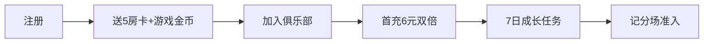

# 新手转化漏斗

> 跨场域（房卡场 + 记分场）共用转化路径。  
> **房卡**为平台通用；**游戏金币**按游戏独立配置（示例：打乌龟见 [dawugui/ops-hooks.md](../../games/dawugui/ops-hooks.md)）。

---

## 1. 漏斗流程

---

## 2. 各阶段明细

| 阶段 | 动作 | 奖励 | 转化率目标 | 主要负责 |
| :--- | :--- | :--- | :--- | :--- |
| 注册 | 自动发放 | 5 房卡（平台）+ 该游戏初始金币 | 100% | 平台 |
| 首局 | 引导完成首局 | 1 房卡 | 80% | 房卡场 / 代理 |
| 加俱乐部 | 推荐 3 个俱乐部 | 2 房卡 | 50% | 房卡场 / 地推 |
| 首充 | 6 元房卡包双倍 | 20 房卡 | 12% | 房卡场 / 代理 |
| 7 日任务 | 每日任务完成 | 累计 10 房卡 | 30% | 共用 |
| 记分场 | 达该游戏新手场准入 | 解锁记分场 | 25% | 记分场 / 官方 |

**打乌龟示例（注册礼包）：** 5 房卡 + 5,000 龟币 — 见 [dawugui/ops-hooks.md](../../games/dawugui/ops-hooks.md) §2.3。

---

## 3. 流失召回

【运营动作】每阶段设置流失召回推送（Push / 短信 / 微信群）：

| 流失节点 | 召回策略 |
| :--- | :--- |
| 注册未首局 | 24h 内推送「免费房卡等你开局」 |
| 首局未加俱乐部 | 推荐附近俱乐部 + 2 房卡奖励 |
| 加俱乐部未首充 | 首充双倍限时提醒 |
| 7 日任务中断 | 推送未完成任务进度 |
| 记分场未准入 | 推送新手场体验（提示已有注册礼包游戏金币） |

---

## 4. 相关文档

| 文档 | 内容 |
| :--- | :--- |
| [room-card/sop.md](../room-card/sop.md) | 俱乐部孵化 |
| [score-field/matching-bankruptcy.md](../score-field/matching-bankruptcy.md) | 记分场准入 |
| [platform/economy-base.md](../../platform/economy-base.md) | 平台房卡经济 |
| [games/dawugui/ops-hooks.md](../../games/dawugui/ops-hooks.md) | 打乌龟游戏金币示例 |
