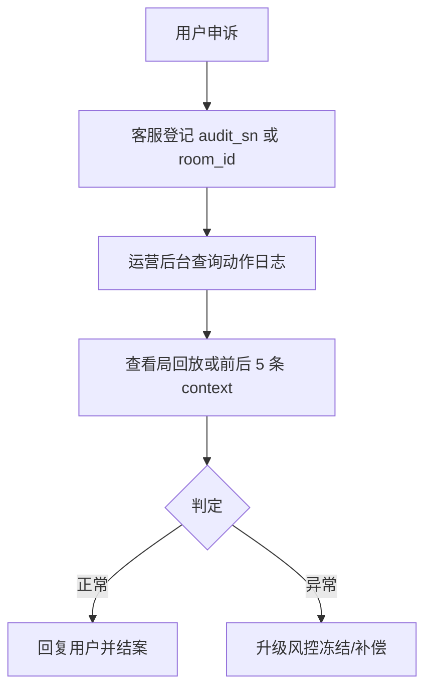

# 战绩回放运营 SOP

> 运营层 — 玩家战绩入口、申诉处理、客服话术。  
> 技术契约：[tech/replay.md](../../tech/replay.md)、[tech/audit-action-log.md](../../tech/audit-action-log.md)

---

## 1. 玩家入口

| 入口 | 路径 | 说明 |
| :--- | :--- | :--- |
| **我的战绩** | App Hall → 战绩 | 列表来自 HTTP `/v1/users/me/matches` |
| **单局回放** | 战绩详情 → 回放 | 局后可见；含全员手牌 |
| **整房回放** | 房间记录 → 整房回放 | 房卡场多局串联 |

【产品需求】战绩列表展示：时间、游戏、胜负、积分/龟币变动、「回放」按钮（`replay_available=true` 时可用）。

---

## 2. 申诉处理 SOP

### 2.1 客服需收集

| 字段 | 说明 |
| :--- | :--- |
| `audit_sn` | 用户截图 Push 或结算页审计号（优先） |
| `room_id` / `round_id` | 无 audit_sn 时用 |
| 申诉时间 | 须在回放保留期内（默认 180 天） |

### 2.2 查询方式（P3 后台 / MVP API）

- `GET /v1/admin/audit/actions?audit_sn=` → 返回该条 + 前后各 5 条 context
- 或直接打开局回放 URL（内网工具）

### 2.3 处理时效

| 优先级 | 时效 |
| :--- | :--- |
| 涉及金币/房卡 | 24h 内 |
| 纯规则争议 | 48h 内 |

与 [risk/anti-fraud.md](../../risk/anti-fraud.md) 异常输赢复核流程衔接。

---

## 3. 客服话术（示例）

| 场景 | 话术要点 |
| :--- | :--- |
| 引导提供 audit_sn | 「请在结算页或报错提示中找到审计号（一串数字），便于我们精确定位该步操作。」 |
| 回放已过期 | 「该局已超过保存期限（180 天），无法提供完整回放，我们可根据账户流水协助核查。」 |
| 判定正常 | 「经系统回放核实，该局规则执行符合打乌龟规则，详见附件回放截图。」 |

---

## 4. 与风控联动

| 触发 | 动作 |
| :--- | :--- |
| 异常输赢标记 | 风控自动关联最近 N 局 `round_id`，拉 replay 复核 |
| 同桌 IP/GPS 告警 | 结合 `game_action_log` 出牌时序分析协作嫌疑 |
| 用户申诉 | 创建工单，绑定 `audit_sn` |

---

## 5. 相关文档

| 文档 | 内容 |
| :--- | :--- |
| [replay-retention.md](replay-retention.md) | 数据保留 |
| [anti-fraud.md](../../risk/anti-fraud.md) | 风控阈值 |
| [metrics.md](../../platform/metrics.md) | replay_view_rate KPI |
