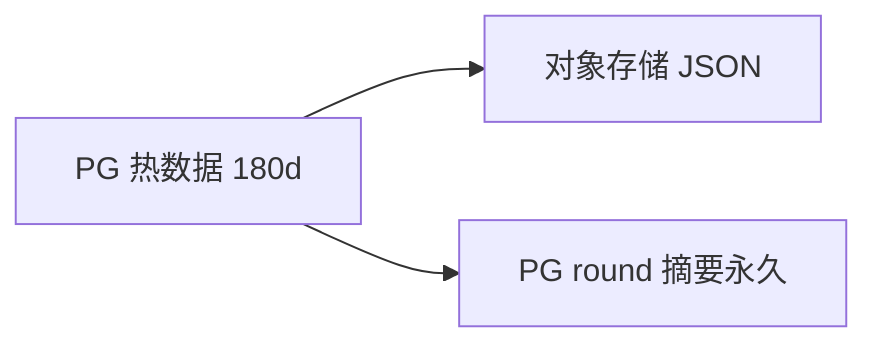

# 对局日志与回放数据保留

> 运营层 — `game_action_log` / 回放 API 保留策略。  
> DDL 见 [tech/audit-action-log.md](../../tech/audit-action-log.md)。

---

## 1. 保留期限

| 数据 | MVP 默认 | 配置项 | 说明 |
| :--- | :--- | :--- | :--- |
| `game_action_log` | **180 天** | `replay.retention_days` | 局内事件明细 |
| `game_round` | 180 天 | 同上 | 局元数据 |
| `room_event_log` | 180 天 | `replay.room_retention_days` | 房间生命周期 |
| 冷归档（成长期） | 永久摘要 | — | PG 留 round 摘要，events 迁对象存储 |

过期后 `replay_available=false`，HTTP replay 返回 404。

---

## 2. 归档策略（成长期）



| 阶段 | 动作 |
| :--- | :--- |
| T+180d | 定时任务：导出 `game_action_log` → S3/OSS |
| 保留 | `game_round` 摘要行（round_id, 胜负, 参与者, event_count） |
| 删除 | 热库 payload BYTEA |

---

## 3. 合规

- 日志 **append-only**，业务侧禁止 UPDATE/DELETE
- 用户注销：匿名化 `user_id` 引用，保留 audit 链（合规要求时）
- 未成年人：按 [compliance.md](../../risk/compliance.md) 限制对局记录查询

---

## 4. 运营配置

可在 `docs/games/{id}/ops-hooks.md` 中覆盖（仅文档约定，实施期 JSONB）：

```json
{
  "replay": {
    "retention_days": 180,
    "enable_room_replay": true
  }
}
```

---

## 5. 相关文档

| 文档 | 内容 |
| :--- | :--- |
| [replay-ops.md](replay-ops.md) | 申诉 SOP |
| [audit-action-log.md](../../tech/audit-action-log.md) | 表结构 |
