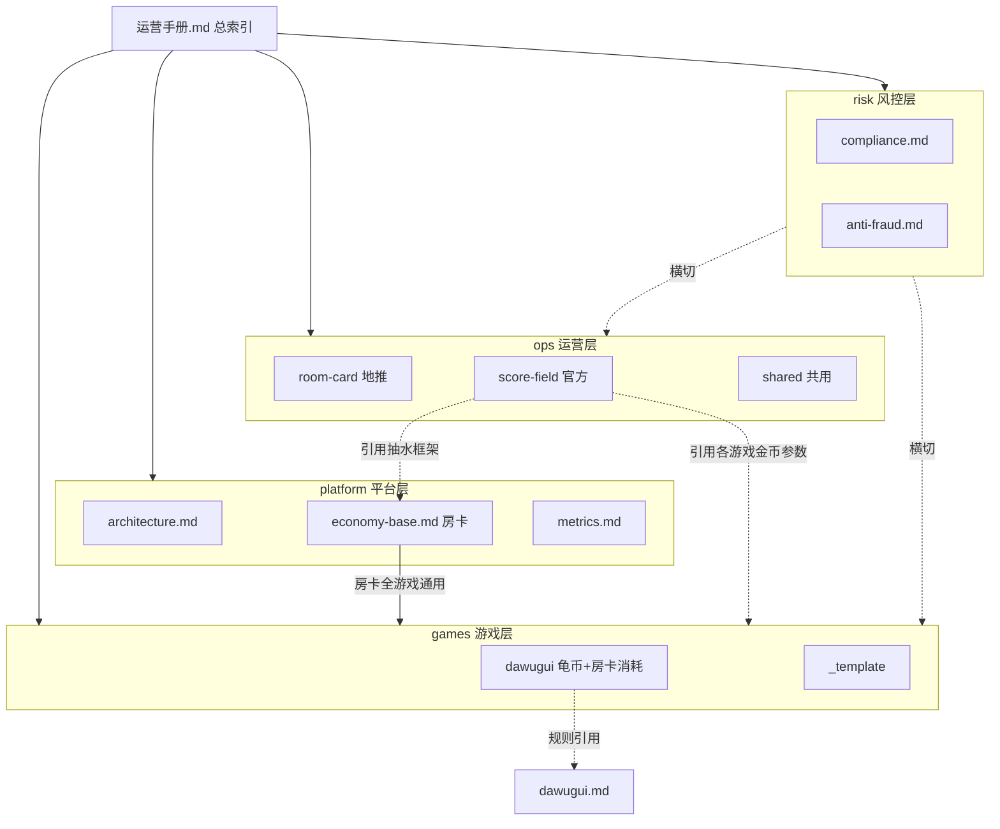
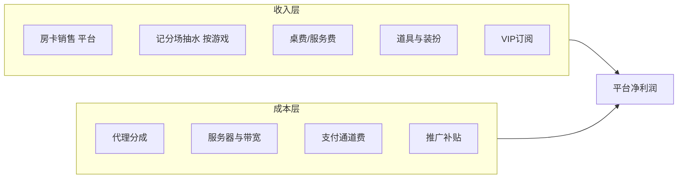

# 平台架构与模块边界

> 平台层文档，与具体游戏无关。总索引见 [运营手册.md](../../运营手册.md)。

---

## 1. 四层架构

---

## 2. 货币绑定

| 货币 | 绑定 | 定义位置 | 说明 |
| :--- | :--- | :--- | :--- |
| **房卡** | 平台 | [economy-base.md](economy-base.md) | 全游戏通用；各游戏配置消耗数量 |
| **游戏金币** | 游戏 | [games/{id}/ops-hooks.md](../games/README.md) | 各游戏独立币种；记分场仅用本游戏金币 |

---

## 3. 场域划分

| 场域 | 运营主体 | 变现方式 | 消耗货币 | 文档入口 |
| :--- | :--- | :--- | :--- | :--- |
| **房卡场** | 地推 / 代理 / 俱乐部 | 房卡销售 | 平台房卡（通用） | [ops/room-card/overview.md](../ops/room-card/overview.md) |
| **记分场** | 平台官方运营 | 抽水（5%） | 各游戏独立金币 | [ops/score-field/overview.md](../ops/score-field/overview.md) |

两条业务线独立运营、独立迭代：房卡经济在 platform 层，游戏金币经济在 games 层。

---

## 4. 耦合原则

| 原则 | 说明 |
| :--- | :--- |
| 房卡平台绑定 | 房卡定价、代理分成只在 platform 定义；games 仅配置消耗数量 |
| 金币游戏绑定 | 各游戏独立金币、场次、产出消耗只在 games/{id}/ 定义 |
| 游戏与运营分离 | 游戏文档不含代理分成、平台房卡定价；记分场文档不含具体金币数值 |
| 房卡场 / 记分场分离 | 互不引用对方业务细节，交叉说明仅链接 |
| 风控横切 | 风控规则在 [risk/](../risk/) 单点维护 |
| 游戏可插拔 | 新游戏新增 ops-hooks + 索引注册，无需改 platform 房卡定价 |

---

## 5. 文档协作约定

以下为**团队协作文档约定**（非编程接口）：

| 文档层 | 须提供 / 须引用 |
| :--- | :--- |
| **platform/economy-base.md** | 房卡定义、定价、默认消耗、代理分成基线、跨游戏货币规则 |
| **games/{id}/ops-hooks.md** | 游戏金币名称、充值比例、场次分级、产出消耗、房卡消耗覆盖、积分算法、特殊状态 |
| **ops/score-field/** | 记分场运营框架（抽水率、匹配、破产逻辑）；具体金币参数引用 games 层 |
| **ops/room-card/** | 引用 platform 房卡定价与代理规则 |
| **ops/** 全部 | 引用 risk/ 风控规则，不重复阈值 |

---

## 6. 收入结构概览

**盈利三层架构：**

1. **启动引擎**：代理房卡现金流（Phase 1）
2. **规模放大器**：各游戏记分场抽水（Phase 2）
3. **利润优化层**：VIP / 赛事 / 道具（Phase 3）

---

## 7. 三阶段路线图

| 阶段 | 时间 | 重点 | 负责文档 |
| :--- | :--- | :--- | :--- |
| Phase 1 | 0~3 月 | 房卡场 + 地推代理 | ops/room-card/ |
| Phase 2 | 3~6 月 | 记分场官方运营（按游戏上线） | ops/score-field/ + games/ |
| Phase 3 | 6 月+ | VIP / 赛事 / 道具 | ops/shared/value-added.md |

详细 KPI 见 [metrics.md](metrics.md)。

---

## 8. 新游戏接入流程

1. 编写游戏规则 PRD（如 [dawugui.md](../../dawugui.md)）
2. 复制 [games/_template/ops-hooks.template.md](../games/_template/ops-hooks.template.md) 填写运营挂点
3. **必须配置**：游戏金币经济（币种、场次、礼包）+ 房卡消耗规则
4. 在 [运营手册.md](../../运营手册.md) 游戏索引中注册

房卡定价与代理分成无需修改，沿用 platform 层。

详见 [games/README.md](../games/README.md)。

技术实现方案见 [tech/README.md](../tech/README.md)（Gin 平台 HTTP + **Pitaya** 游戏实时层 + Cocos PitayaClient）。
