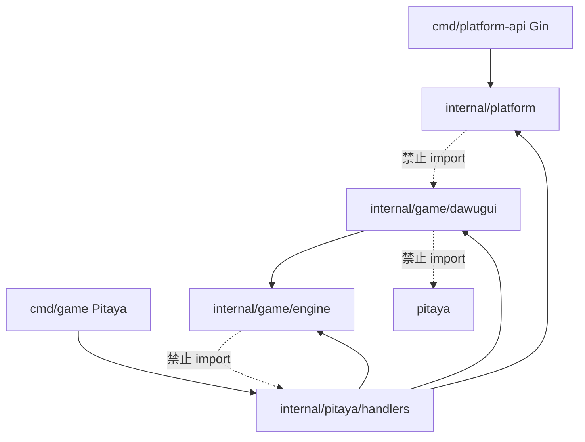

# ADR-002：可插拔游戏架构约束

| 项 | 值 |
| :--- | :--- |
| **Status** | Accepted |
| **Date** | 2026-07 |
| **Depends on** | ADR-001, ADR-004, ADR-005 |

---

## 背景

平台需支持多游戏（dawugui 及后续），增游戏时 **不改** wallet、room 核心、OpenAPI 公共 schema、签名/JWT 中间件。

---

## 包依赖规则

| 规则 | 说明 |
| :--- | :--- |
| `internal/platform/*` | **禁止** import `internal/game/{具体游戏}` |
| `internal/game/{id}/` | **禁止** import `github.com/topfreegames/pitaya` |
| `internal/game/engine` | 仅定义 interface 与类型，无 IO |
| `internal/pitaya/handlers/*` | 薄层：Session/Group/Push/audit，调用 Engine |
| `cmd/platform-api` | **禁止** import pitaya handlers |

---

## 增游戏白名单

| 允许改动 | 路径 |
| :--- | :--- |
| 规则引擎 | `internal/game/{gameId}/` |
| Pitaya Handler | `internal/pitaya/handlers/{gameId}/` |
| 注册 | `internal/game/registry.go` + `cmd/game` Register |
| Proto | `proto/pitaya/{gameId}.proto` |
| 运营配置 | `docs/games/{gameId}/ops-hooks.md` → PG JSONB |
| 文档 | games/README、运营手册 |

| 禁止改动 | 说明 |
| :--- | :--- |
| `internal/platform/wallet` | 房卡/游戏币逻辑 |
| `openapi/components/` 公共 schema | 除新增游戏 config 字段外 |
| `openapi/http-signature.md` | 签名算法 |
| `internal/pitaya/handlers/connector` | 除非平台级变更 |
| `internal/pitaya/handlers/room` | 除非房间流程变更 |

---

## Proto / Route 规范

### Route 命名

格式：`{serverType}.{handler}.{method}`，MVP `serverType=game`。

| 域 | Handler | 示例 |
| :--- | :--- | :--- |
| 连接 | connector | `game.connector.entry` |
| 房间 | room | `game.room.join` |
| 游戏 | {gameId} | `game.dawugui.playcards` |

### Push Route（服务端→客户端）

| Push | Route |
| :--- | :--- |
| 房间状态 | `onRoomState` |
| 发牌 | `onDeal` |
| 轮次 | `onTurnNotify` |
| 报单 | `onAlert` |
| 结算 | `onSettlement` |
| 错误 | `onError` |

### Proto 文件编号段

| 文件 | 包 | 用途 |
| :--- | :--- | :--- |
| `proto/pitaya/common.proto` | pitaya.common | EventMeta、PushHeader |
| `proto/pitaya/event.proto` | pitaya.event | GameEvent oneof（落库） |
| `proto/pitaya/connector.proto` | pitaya.connector | entry/bind |
| `proto/pitaya/room.proto` | pitaya.room | join/ready/leave/sync |
| `proto/pitaya/dawugui.proto` | pitaya.dawugui | 打乌龟 req/rsp/push |

新游戏新增 `proto/pitaya/{gameId}.proto`，**不修改**已有 message 字段编号；GameEvent 扩展见 ADR-005。

### EventMeta / audit_sn

- 所有 **Push** 必含 `PushHeader.meta`（`audit_sn` + `action_seq`）
- 与 `game_action_log` 一 event 一 log
- Request Response 可选 `EventMeta`（playcards/pass）

---

## GameEngine 接口稳定性

- `internal/game/engine` 接口变更需 ADR 修订
- 新增 optional 方法优先用 interface 版本化（`GameEngineV2`）而非破坏现有实现

---

## 成长期演进（文档预留）

| 阶段 | 变更 |
| :--- | :--- |
| Cluster | `connector` Frontend + `game` Backend；`AddRoute(room_id)` |
| 平台 Remote | Wallet 抽为 `platform` serverType，User RPC |
| 热更新配置 | watch PG `game_config`，Engine 版本灰度 |

---

## 相关文档

| 文档 | 内容 |
| :--- | :--- |
| [004-pitaya-game-framework.md](004-pitaya-game-framework.md) | Handler/Engine 分工 |
| [proto/pitaya/README.md](../proto/pitaya/README.md) | Route proto |
| [005-ordered-action-log-replay.md](005-ordered-action-log-replay.md) | 有序日志 |
| [audit-action-log.md](../audit-action-log.md) | DDL |
