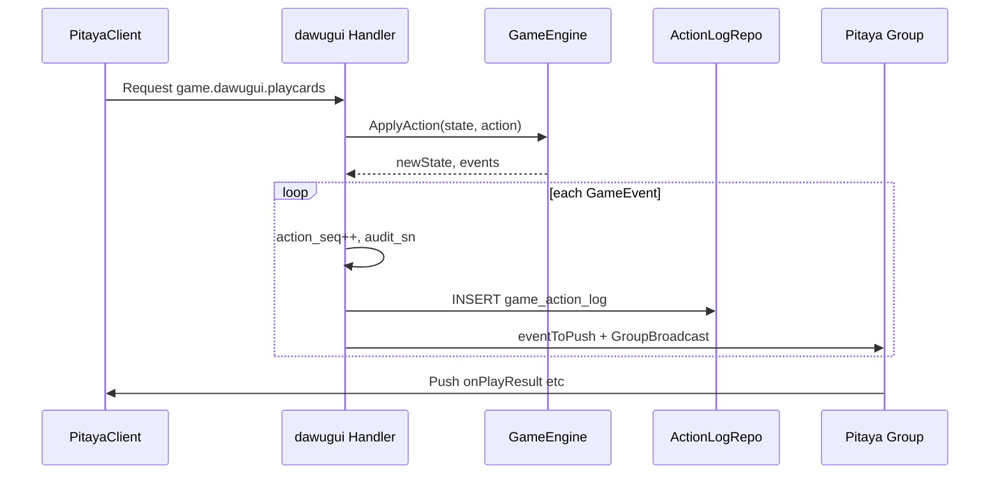

# ADR-004：Pitaya 游戏框架

| 项 | 值 |
| :--- | :--- |
| **Status** | Accepted |
| **Date** | 2026-07 |
| **Depends on** | ADR-001, ADR-002, ADR-005 |

---

## 决策

采用 **Pitaya v2 Standalone** 作为游戏实时层；**GameEngine** 保持纯规则；**Pitaya Handler** 为薄适配层。

---

## 分层职责

| 层 | 包 | 职责 |
| :--- | :--- | :--- |
| Pitaya Handler | `internal/pitaya/handlers/*` | Session、Group、Push、Pipeline、调 Engine、写 audit |
| GameEngine | `internal/game/{id}/` | 纯规则：State + ApplyAction + CalcSettlement |
| Platform | `internal/platform/*` | 钱包、房间元数据、PG/Redis |
| Groups | Pitaya Groups API | `room_id` 广播 |



详见 [ADR-005](005-ordered-action-log-replay.md) 与 `commitEvents()`。

---

## Handler 组件（MVP）

| Component | Name | 方法 | Route |
| :--- | :--- | :--- | :--- |
| ConnectorHandler | connector | Entry | `game.connector.entry` |
| ConnectorHandler | connector | Bind | `game.connector.bind` |
| RoomHandler | room | Join | `game.room.join` |
| RoomHandler | room | Ready | `game.room.ready` |
| RoomHandler | room | Leave | `game.room.leave` |
| RoomHandler | room | Sync | `game.room.sync` |
| DawuguiHandler | dawugui | PlayCards | `game.dawugui.playcards` |
| DawuguiHandler | dawugui | Pass | `game.dawugui.pass` |

注册示例（文档级）：

```go
app.Register(&connector.Handler{}, component.WithName("connector"))
app.Register(&room.Handler{}, component.WithName("room"))
app.Register(&dawugui.Handler{}, component.WithName("dawugui"))
pitaya.SetSerializer(protobuf.NewSerializer())
```

---

## Push 路由表

| Push Route | Proto | 触发 |
| :--- | :--- | :--- |
| `onRoomState` | RoomStatePush | join/ready/phase 变更 |
| `onDeal` | DealPush | 发牌 |
| `onTurnNotify` | TurnNotifyPush | 轮次变更 |
| `onPlayResult` | PlayResultPush | 出牌/过牌结果 |
| `onAlert` | AlertPush | 强制报单 |
| `onRoundInvalid` | RoundInvalidPush | 无效局 |
| `onSettlement` | SettlementPush | 结算 |
| `onError` | ErrorPush | 错误 |

所有 Push 嵌入 `PushHeader` → `EventMeta`（`audit_sn`, `action_seq`, `round_id`, `round_no`, `room_id`, `server_ts`）+ `game_id`。

Push 与 `game_action_log` **一 event 一 log**，见 [audit-action-log.md](../audit-action-log.md)。

---

## GameEngine 契约

```go
// internal/game/engine — 伪代码
type GameEvent interface {
    Type() EventType
    PushRoute() string
    Actor() uint64
    MarshalProto() []byte
}

type GameEngine interface {
    Meta() GameMeta
    NewState(cfg GameConfig, players []Player) (GameState, []GameEvent, error)
    ApplyAction(state GameState, action Action) (GameState, []GameEvent, error)
    OnTick(state GameState, now time.Time) (GameState, []GameEvent, error)
    VisibleState(state GameState, seat Seat) (any, error)
    CheckRoundEnd(state GameState) (RoundEnd, bool)
    CalcSettlement(state GameState, end RoundEnd) (SettlementResult, error)
}
```

Proto 契约：[proto/pitaya/event.proto](../proto/pitaya/event.proto)。

| 职责 | Handler | Engine | ActionLogRepo |
| :--- | :--- | :--- | :--- |
| 校验 JWT/座位 | ✓ | | |
| 产出 GameEvent | eventToPush | ✓ | |
| action_seq / audit_sn | ✓ | | |
| INSERT game_action_log（先写后推） | ✓ | | ✓ |
| Group 广播 | ✓ | | |
| 钱包结算 | ✓（调 platform） | 只算分 | |
| 牌型/状态机 | | ✓ | |
| Replay 读 log | ReplayService | 可选校验 | ✓ |

---

## 房间与 Group

- HTTP 开房写入 PG `room` 元数据
- Pitaya `room.join`：校验 HTTP 侧资格 → `groups.AddMember(room_id, uid)` 
- 广播：`pitaya.GroupBroadcast(ctx, "game", groupName, route, protoMsg)`
- 房间状态（Engine State）存 **Handler 内存 map[room_id]**；Redis 存摘要供断线查询

---

## Pipeline（Pitaya 中间件）

| Pipeline | 时机 | 职责 |
| :--- | :--- | :--- |
| AuthPipeline | Handler 前 | 校验 session 已 Bind |
| AuditPipeline | Handler 后 | slog 结构化（audit_sn, action_seq）；PG 写入在 commitEvents 内 |
| RateLimit | 可选 | 复用 Pitaya acceptor wrapper |

JWT 校验在 `connector.bind`：HTTP 登录 token → `session.Bind(userId)`。

---

## 进房闭环

1. HTTP `POST /v1/auth/login` → JWT
2. HTTP `POST /v1/rooms` → `room_id`, `ws_url`
3. PitayaClient.connect → `game.connector.entry`
4. `game.connector.bind`（JWT）→ session.Bind
5. `game.room.join` → Group + onRoomState
6. `game.room.ready` → 全员 ready 后 Engine.NewState → onDeal

---

## 状态机

- 各游戏 **手写 phase enum**（不用 FSM 库）
- dawugui 见 [game-framework.md](../game-framework.md) §3

---

## Standalone → Cluster 迁移

| MVP Standalone | 成长期 Cluster |
| :--- | :--- |
| Handler 直调 platform | game Backend + platform Remote RPC |
| 单进程 Groups | 跨节点 Push/Bind（binding storage） |
| 无 etcd | etcd 服务发现 |
| 无 NATS | NATS Sys/User RPC |

---

## 相关文档

| 文档 | 内容 |
| :--- | :--- |
| [pitaya-client.md](../pitaya-client.md) | Cocos 客户端 |
| [proto/pitaya/README.md](../proto/pitaya/README.md) | Proto 定义 |
| [005-ordered-action-log-replay.md](005-ordered-action-log-replay.md) | 有序日志与回放 |
| [audit-action-log.md](../audit-action-log.md) | DDL |
| [replay.md](../replay.md) | HTTP 回放 API |
