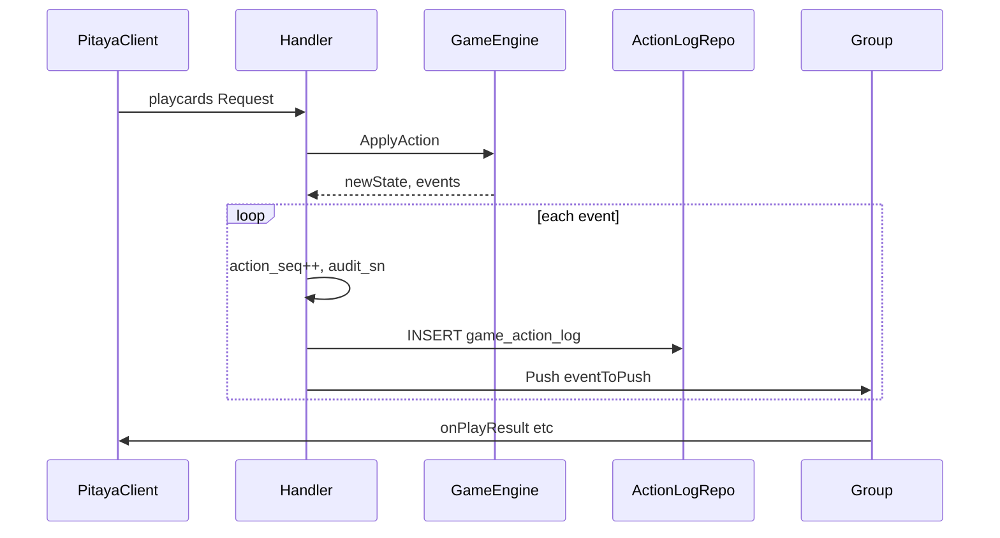
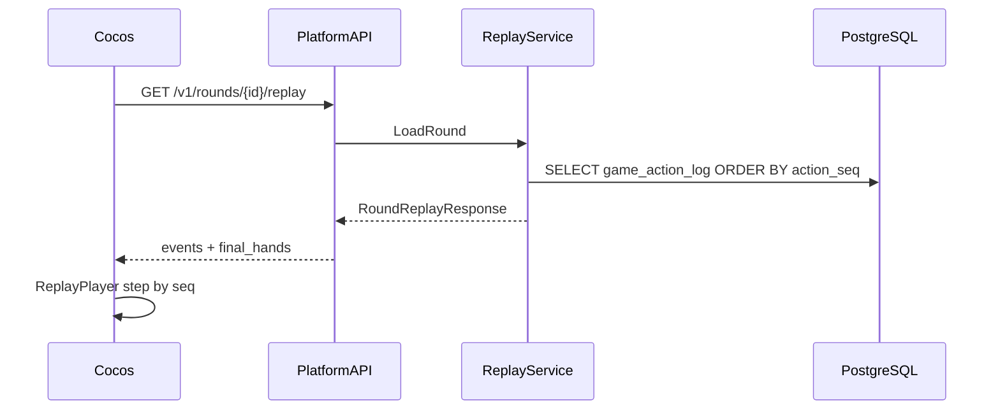

# ADR-005：有序动作日志与玩家回放

| 项 | 值 |
| :--- | :--- |
| **Status** | Accepted |
| **Date** | 2026-07 |
| **Depends on** | ADR-001, ADR-002, ADR-004 |

---

## 背景

棋牌对局**严格有序**：每条逻辑事件（发牌、出牌、过牌、报单、结算等）须持久化并可按序重放。玩家需查看**局后战绩回放**（全员手牌可见）；房卡场需支持**整房多局串联**。现有 `audit_sn` 仅作全局审计锚点，缺少局内 `action_seq` 与回放 API。

---

## 决策

### 1. 双标识模型

| 字段 | 作用域 | 用途 |
| :--- | :--- | :--- |
| `audit_sn` | 全局 Snowflake | 审计、钱包/申诉/风控、`ref_audit_sn` |
| `action_seq` | 局内 `(room_id, round_id)` | 有序回放、断线补发、丢包检测 |

每条 `game_action_log` 行：**一个 `audit_sn` 对应一个 `action_seq`**（一 event 一 log）。

### 2. 一 event 一 log，先写后推

- GameEngine 返回 `[]GameEvent`；Handler 对**每条 event** 分配 seq/audit_sn → INSERT → Push
- **INSERT 先于 GroupBroadcast**；Push 失败 slog 补偿，**不重排 seq**
- 落库存 **proto `GameEvent`** 序列化，非 Push 二进制
- Live 与 Replay 共用 `eventToPush()` 映射

### 3. 三张表分工

| 表 | 有序字段 | 内容 |
| :--- | :--- | :--- |
| `room_event_log` | `room_seq` | join/leave/ready/round_start/round_end/dismiss |
| `game_round` | `round_no` | 局元数据、配置快照、结果摘要 |
| `game_action_log` | `action_seq` | 局内每条逻辑事件 |

### 4. 回放策略

| 场景 | 通道 | 说明 |
| :--- | :--- | :--- |
| 局后战绩回放 | HTTP `GET /v1/rounds/{round_id}/replay` | events + `final_hands`（局已结束，全员手牌可见） |
| 整房串联 | HTTP `GET /v1/rooms/{room_id}/replay` | 多局 rounds[]，客户端按 round 切换 |
| 断线补发 | Pitaya `game.room.sync` | `since_action_seq` → 补发 Push |
| 运营审计 | HTTP `GET /v1/admin/audit/actions` | P3 后台；MVP 先定义契约 |

**确定性重放（可选校验）**：`NewState(config_snapshot)` + 顺序 `ApplyAction`；`state_hash` 文档级可选。

### 5. 隐私

- **局进行中**：`VisibleState` 掩码 + sync 补发（不暴露他人手牌）
- **局已结束**：Replay API 返回 `final_hands`，全员完整手牌

---

## 序列图





---

## Handler 伪代码

```go
func (h *Handler) commitEvents(ctx context.Context, round *Round, events []GameEvent, c2sMeta *C2SMeta) error {
    for _, ev := range events {
        round.ActionSeq++
        sn := h.audit.Next()
        row := ActionLogRow{
            RoundID: round.ID, ActionSeq: round.ActionSeq, AuditSN: sn,
            EventType: ev.Type(), Payload: ev.MarshalProto(),
            PushRoute: ev.PushRoute(), ActorUserID: ev.Actor(),
        }
        if c2sMeta != nil {
            row.C2SRoute, row.C2SRequestID = c2sMeta.Route, c2sMeta.RequestID
        }
        if err := h.logRepo.Insert(ctx, row); err != nil {
            return err
        }
        push := h.eventToPush(round, ev, sn)
        if err := h.groupBroadcast(ctx, round.RoomID, push); err != nil {
            slog.Error("push failed after log", "audit_sn", sn, "err", err)
        }
    }
    return nil
}
```

---

## 非 C2S 事件落库

| 触发 | 示例 event | 落库 |
| :--- | :--- | :--- |
| `NewState` | DealEvent, TurnEvent | ✓ |
| `ApplyAction` | PlayEvent, PassEvent, AlertEvent | ✓ |
| `OnTick` | 超时托管 PassEvent | ✓ |
| `CheckRoundEnd` | RoundEndEvent, SettlementEvent | ✓ |
| `room.join/ready` | RoomStateEvent | ✓ → `room_event_log` + 可选 `game_action_log` |

房间生命周期写 `room_event_log`；进入 PLAYING 后的局内事件写 `game_action_log`。

---

## 后果

| 正面 | 代价 |
| :--- | :--- |
| 完整有序审计链 | 每局多行 PG 写入 |
| 玩家回放 + 运营申诉 | proto `GameEvent` 需版本化 |
| 断线 catch-up | Handler 须统一 `commitEvents` |

---

## 相关文档

| 文档 | 内容 |
| :--- | :--- |
| [audit-action-log.md](../audit-action-log.md) | DDL、写入规则 |
| [replay.md](../replay.md) | HTTP Replay API |
| [004-pitaya-game-framework.md](004-pitaya-game-framework.md) | Handler/Engine 分工 |
| [proto/pitaya/event.proto](../proto/pitaya/event.proto) | GameEvent 契约 |
