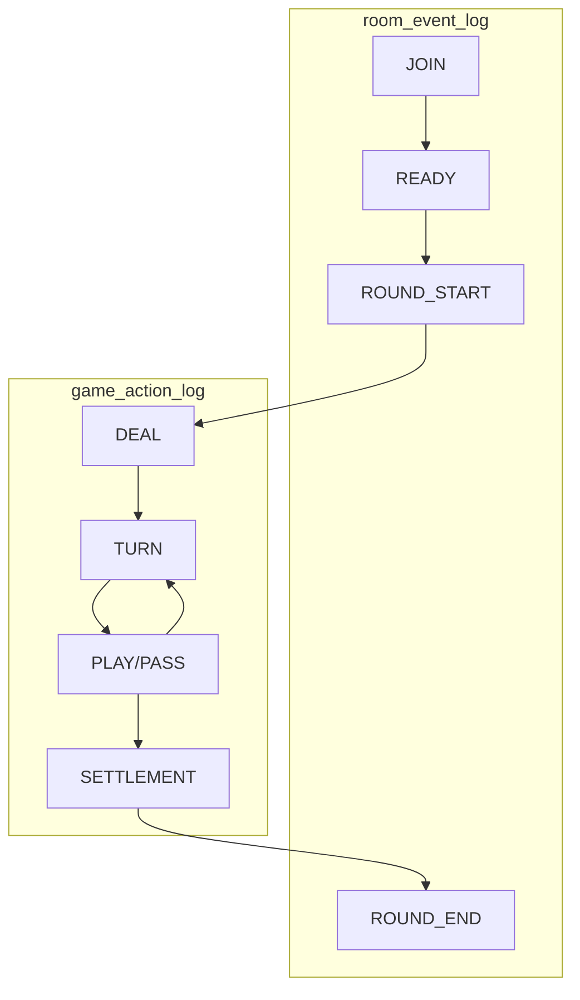

# 有序动作日志（audit-action-log）

> 技术层 — `game_action_log` / `game_round` / `room_event_log` 数据模型与写入规则。  
> ADR：[005-ordered-action-log-replay.md](adr/005-ordered-action-log-replay.md)

---

## 1. 设计原则

- **每条逻辑事件必记**：发牌、出牌、过牌、报单、轮次、结算、无效局等
- **局内严格有序**：`action_seq` 从 1 单调递增，不可重用或跳号
- **一 event 一 log**：一个 `audit_sn` 对应一个 `action_seq`
- **先写后推**：INSERT 成功后再 GroupBroadcast
- **存 GameEvent**：payload 为 `proto/pitaya/event.proto` 序列化 bytes

---

## 2. 表结构（文档 DDL）

### 2.1 `game_round`

```sql
CREATE TABLE game_round (
    round_id        UUID PRIMARY KEY DEFAULT gen_random_uuid(),
    room_id         UUID NOT NULL REFERENCES room(room_id),
    round_no        INT NOT NULL,                    -- 整房内从 1 递增
    game_id         VARCHAR(32) NOT NULL,
    status          VARCHAR(16) NOT NULL,            -- playing | ended | invalid
    config_snapshot JSONB NOT NULL,                  -- 开局配置快照（replay 用）
    started_at      TIMESTAMPTZ NOT NULL DEFAULT now(),
    ended_at        TIMESTAMPTZ,
    winner_user_ids BIGINT[],
    settlement_audit_sn BIGINT,                      -- 关联 settlement_record
    created_at      TIMESTAMPTZ NOT NULL DEFAULT now(),
    UNIQUE (room_id, round_no)
);

CREATE INDEX idx_game_round_room ON game_round (room_id, round_no DESC);
CREATE INDEX idx_game_round_status ON game_round (status, ended_at DESC);
```

### 2.2 `game_action_log`（append-only）

```sql
CREATE TABLE game_action_log (
    id              BIGSERIAL PRIMARY KEY,
    room_id         UUID NOT NULL,
    round_id        UUID NOT NULL REFERENCES game_round(round_id),
    action_seq      INT NOT NULL,                    -- 局内从 1 递增
    audit_sn        BIGINT NOT NULL,                 -- Snowflake，全局唯一
    event_type      VARCHAR(32) NOT NULL,            -- 见 §3 EventType 枚举
    actor_user_id   BIGINT,                          -- 系统事件可为 NULL
    seat            SMALLINT,
    payload         BYTEA NOT NULL,                  -- proto GameEvent
    push_route      VARCHAR(64) NOT NULL,            -- 如 onPlayResult
    server_ts       TIMESTAMPTZ NOT NULL DEFAULT now(),
    c2s_route       VARCHAR(64),                     -- 触发该 event 的 C2S route
    c2s_request_id  UUID,                            -- Pitaya msg id / 客户端 request id
    UNIQUE (round_id, action_seq),
    UNIQUE (audit_sn)
);

CREATE INDEX idx_action_log_round_seq ON game_action_log (round_id, action_seq);
CREATE INDEX idx_action_log_room ON game_action_log (room_id, server_ts);
CREATE INDEX idx_action_log_actor ON game_action_log (actor_user_id, server_ts DESC);
```

**禁止** UPDATE / DELETE（合规归档走冷存储迁移，非业务 UPDATE）。

### 2.3 `room_event_log`（append-only）

```sql
CREATE TABLE room_event_log (
    id              BIGSERIAL PRIMARY KEY,
    room_id         UUID NOT NULL,
    room_seq        INT NOT NULL,                    -- 整房从 1 递增
    event_type      VARCHAR(32) NOT NULL,            -- 见 §3 RoomEventType
    user_id         BIGINT,
    audit_sn        BIGINT NOT NULL UNIQUE,
    payload         JSONB,                           -- 扩展字段（座位、原因等）
    server_ts       TIMESTAMPTZ NOT NULL DEFAULT now(),
    UNIQUE (room_id, room_seq)
);

CREATE INDEX idx_room_event_room ON room_event_log (room_id, room_seq);
```

### 2.4 `settlement_record`（已有，补充关联）

```sql
-- 文档级补充字段
ALTER TABLE settlement_record ADD COLUMN IF NOT EXISTS round_id UUID REFERENCES game_round(round_id);
ALTER TABLE settlement_record ADD COLUMN IF NOT EXISTS audit_sn BIGINT UNIQUE;
```

---

## 3. 事件类型枚举

### GameEventType（`game_action_log.event_type`）

| 值 | 说明 | Push Route |
| :--- | :--- | :--- |
| `ROOM_STATE` | 阶段/座位变更（局内） | `onRoomState` |
| `DEAL` | 发牌 | `onDeal` |
| `TURN` | 轮次通知 | `onTurnNotify` |
| `PLAY` | 出牌 | `onPlayResult` |
| `PASS` | 过牌 | `onPlayResult` |
| `ALERT` | 强制报单 | `onAlert` |
| `ROUND_INVALID` | 无效局 | `onRoundInvalid` |
| `SETTLEMENT` | 结算 | `onSettlement` |

### RoomEventType（`room_event_log.event_type`）

| 值 | 说明 |
| :--- | :--- |
| `ROOM_CREATED` | HTTP 开房 |
| `JOIN` | Pitaya join |
| `LEAVE` | Pitaya leave |
| `READY` | ready |
| `ROUND_START` | 新局开始（写入 game_round） |
| `ROUND_END` | 局结束 |
| `DISMISS` | 房间解散 |

---

## 4. seq 分配规则

| 序号 | 作用域 | 分配者 | 重置时机 |
| :--- | :--- | :--- | :--- |
| `room_seq` | 整房 | RoomHandler 内存 / Redis | 房间创建时置 0，每条 room_event +1 |
| `round_no` | 整房 | RoomHandler | 每局 +1 |
| `action_seq` | 单局 | DawuguiHandler 内存（round 态） | 每局 `ROUND_START` 置 0，每条 game event +1 |

**并发**：单 room 串行处理（Pitaya Handler 单 goroutine per room 或 room 级 mutex）。

---

## 5. 写入时机



| 路径 | 写 room_event_log | 写 game_action_log |
| :--- | :--- | :--- |
| HTTP 开房 | ROOM_CREATED | — |
| room.join | JOIN | — |
| room.ready（全员 ready） | ROUND_START + INSERT game_round | 随后 NewState → DEAL 等 |
| dawugui.playcards/pass | — | PLAY/PASS + 衍生 TURN/ALERT |
| 局结束 | ROUND_END | SETTLEMENT |
| room.leave | LEAVE | — |

---

## 6. 事务边界

| 操作 | 事务范围 |
| :--- | :--- |
| 普通出牌 | 单条 INSERT game_action_log（独立事务） |
| 结算 | INSERT game_action_log + INSERT settlement_record + wallet_ledger **同一事务** |
| 记分场扣款 | settlement 事务内；`PlayerCoin.audit_sn` 与 SETTLEMENT event 的 `audit_sn` 可不同（钱包独立 Snowflake） |

Push 在事务 **COMMIT 之后** 执行。

---

## 7. PushHeader / EventMeta 对齐

每条 Push 的 `EventMeta` 必须与对应 log 行一致：

```protobuf
message EventMeta {
  uint64 audit_sn = 1;
  uint32 action_seq = 2;
  string round_id = 3;
  uint32 round_no = 4;
  string room_id = 5;
  int64 server_ts = 6;
}
```

---

## 8. 与 Engine 的关系

- Engine 返回 `[]GameEvent`（Go interface / proto oneof）
- Handler 不将 Engine State 全量写入 PG（热态仍在内存 + Redis 摘要）
- Replay 时：`config_snapshot` + 顺序 `ApplyAction` 可重建 State；log 为权威顺序源

---

## 9. 保留与归档

详见 [ops/shared/replay-retention.md](../ops/shared/replay-retention.md)。

| 阶段 | game_action_log | room_event_log |
| :--- | :--- | :--- |
| MVP | 180 天 PG | 180 天 PG |
| 成长期 | 热 PG + 冷对象存储 | 同左 |

---

## 10. 相关文档

| 文档 | 内容 |
| :--- | :--- |
| [replay.md](replay.md) | 回放 HTTP API |
| [proto/pitaya/event.proto](proto/pitaya/event.proto) | GameEvent proto |
| [platform-architecture.md](platform-architecture.md) | 平台分层 |
| [005-ordered-action-log-replay.md](adr/005-ordered-action-log-replay.md) | ADR |
