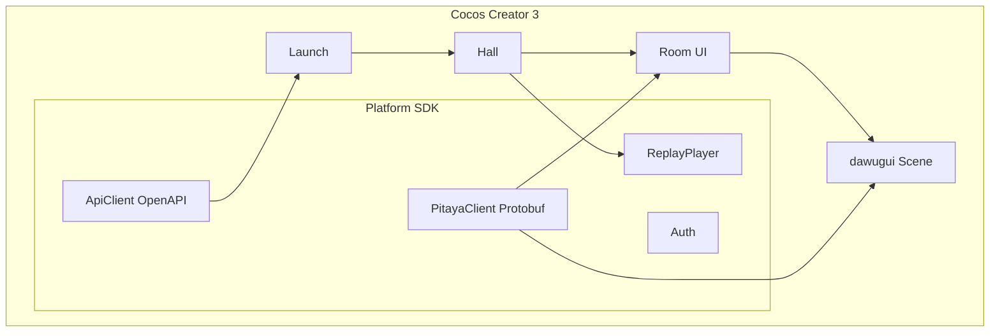
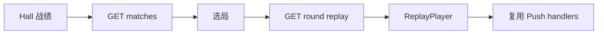

# Cocos Creator 3 客户端架构

> **ApiClient（HTTP）** + **PitayaClient（WS）** 双通道。  
> Pitaya 规范见 [pitaya-client.md](pitaya-client.md)。

---

## 1. 选型

| 项 | 说明 |
| :--- | :--- |
| 引擎 | Cocos Creator 3 + TypeScript |
| HTTP | OpenAPI 生成 + HMAC 签名 |
| 实时 | **自研 PitayaClient** + Protobuf |

---

## 2. 分层



| 模块 | 职责 |
| :--- | :--- |
| `ApiClient` | 登录、开房、钱包；HMAC + JWT |
| `PitayaClient` | WS、route request、push 订阅、sync catch-up |
| `ReplayPlayer` | HTTP 拉 replay、按 seq 驱动 UI |
| `EventTracker` | 维护 lastActionSeq、gap 检测 |
| `games/dawugui/` | 牌桌 UI、Push 驱动动画 |

---

## 3. HTTP 集成

- 契约：[openapi/openapi.yaml](openapi/openapi.yaml)
- 生成：`openapi-generator-cli` → `generated/api/`
- 签名：[http-signature.md](openapi/http-signature.md)

---

## 4. PitayaClient 集成

- Proto：[proto/pitaya/](proto/pitaya/)
- 生成：`ts-proto` → `generated/pitaya/`
- `binaryType = 'arraybuffer'`

| API | 用途 |
| :--- | :--- |
| `request('game.room.join', req)` | 进房 |
| `request('game.dawugui.playcards', req)` | 出牌 |
| `request('game.room.sync', req)` | 断线补发 |
| `onPush('onDeal', handler)` | 发牌动画 |

---

## 5. 战绩回放（ReplayPlayer）



| 组件 | 职责 |
| :--- | :--- |
| `ReplayScene` | 回放专用场景（或 GameScene replay 模式） |
| `ReplayPlayer` | 按 action_seq 步进；倍速/跳步 |
| Push handlers | 与 live 共用，保证 UI 一致 |

入口：Hall → 我的战绩 → 单局回放 / 整房串联。

---

## 6. 场景流转

```
Launch → Hall → [HTTP 开房] → Room → [Pitaya join/ready] → GameScene
```

| 场景 | 协议 |
| :--- | :--- |
| 登录 | HTTP |
| 开房 | HTTP |
| 对局 | Pitaya Request + Push |

---

## 7. UI 与 Push

| Push | UI |
| :--- | :--- |
| `onAlert` | 强制报单全屏 |
| `onSettlement` | 包牌/结算动画 |
| `onRoundInvalid` | 无效局提示 |

以 Push 为准，不本地判规则。

---

## 8. 目录

```
client/assets/platform/
├── sdk/
│   ├── ApiClient.ts
│   ├── PitayaClient.ts
│   ├── PitayaPacket.ts
│   ├── EventTracker.ts
│   └── ReplayPlayer.ts
├── generated/
│   ├── api/
│   └── pitaya/
└── hall/
client/assets/games/dawugui/
```

---

## 9. 新游戏客户端

1. 复制 `games/_template/`
2. 订阅新 Push routes
3. `request('game.{id}.*')` 调用
4. Hall 注册入口 + ReplayPlayer 注册 event 映射

---

## 10. 相关文档

| 文档 | 内容 |
| :--- | :--- |
| [replay.md](replay.md) | 回放 API |
| [pitaya-client.md](pitaya-client.md) | PitayaClient 规范 |
| [game-framework.md](game-framework.md) | 服务端路由 |
| [protocol.md](protocol.md) | 双通道总览 |
