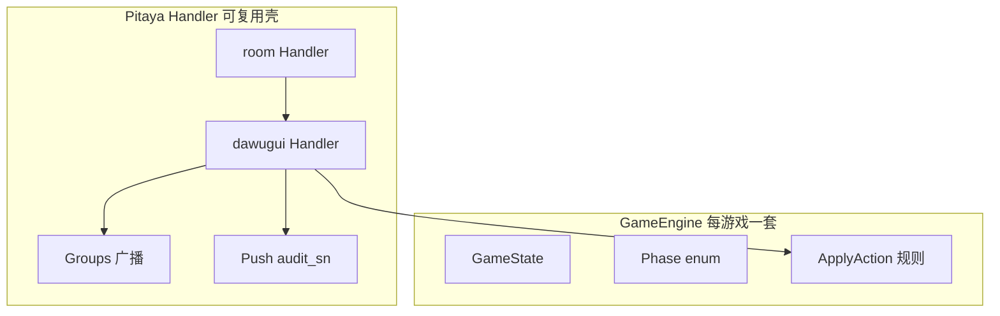
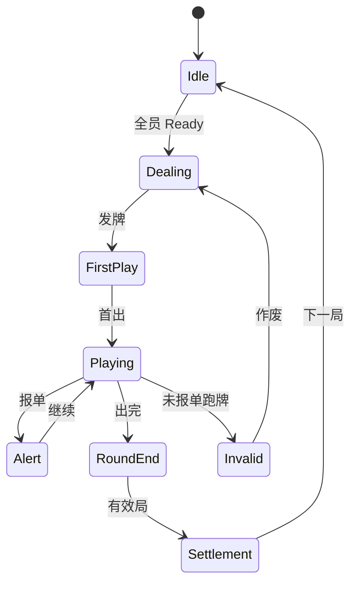
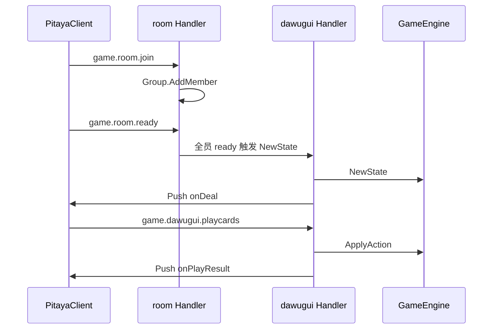

# 可插拔游戏框架（Pitaya + GameEngine）

> **Pitaya Handler** 负责 IO；**GameEngine** 负责纯规则。  
> ADR：[004-pitaya-game-framework.md](adr/004-pitaya-game-framework.md)、[005-ordered-action-log-replay.md](adr/005-ordered-action-log-replay.md)

---

## 1. 设计原则

- **服务端权威**：规则在 GameEngine 执行
- **双层架构**：Pitaya Handler（薄）+ GameEngine（厚规则）
- **可插拔**：新游戏 = Handler + Engine + proto + ops-hooks
- **框架无关**：Engine **禁止** import Pitaya/Gin/Redis

---

## 2. 分层



| 层 | 职责 | 增游戏 |
| :--- | :--- | :--- |
| `internal/pitaya/handlers/room` | join/ready/leave、Group | 不改 |
| `internal/pitaya/handlers/{id}` | 游戏 C2S 路由、Push | **新增** |
| `internal/game/{id}/` | 纯规则 Engine | **新增** |

---

## 3. GameEngine 契约

| 方法 | 职责 | dawugui |
| :--- | :--- | :--- |
| `Meta()` | game_id、人数 | 3~5 人 |
| `NewState()` | 开局状态 | 洗牌、发牌 |
| `ApplyAction()` | 出牌/过牌 | 压制、接风 |
| `OnTick()` | 超时托管 | 可选 |
| `VisibleState()` | 断线重连掩码 | 手牌隐私 |
| `CheckRoundEnd()` | 胜负/无效局 | 报单/作废 |
| `CalcSettlement()` | 规则积分 | §9 算法 |

Handler 统一 `commitEvents()`：**每条 GameEvent** → `action_seq++` → INSERT `game_action_log` → `eventToPush()` → GroupBroadcast。详见 [audit-action-log.md](audit-action-log.md)。

---

## 4. Pitaya 路由（dawugui）

| 类型 | Route | Proto |
| :--- | :--- | :--- |
| Request | `game.room.sync` | SyncReq/Rsp（断线补发） |
| Request | `game.dawugui.playcards` | PlayCardsReq/Rsp |
| Request | `game.dawugui.pass` | PassReq/Rsp |
| Push | `onDeal` | DealPush |
| Push | `onTurnNotify` | TurnNotifyPush |
| Push | `onAlert` | AlertPush |
| Push | `onSettlement` | SettlementPush |

完整表见 [proto/pitaya/README.md](proto/pitaya/README.md)。

---

## 5. 状态机（打乌龟）



- **手写 phase enum**，不用 FSM 库
- 进入 Alert：**服务端自动 Push onAlert**（不依赖客户端上报）

---

## 6. 事件落库（NewState / OnTick / 结算）

| 触发 | Engine 方法 | 写入 game_action_log |
| :--- | :--- | :--- |
| 全员 ready | `NewState` | DEAL, TURN, ROOM_STATE |
| 出牌/过牌 | `ApplyAction` | PLAY/PASS + 衍生 TURN/ALERT |
| 超时托管 | `OnTick` | PASS（系统 actor） |
| 局结束 | `CheckRoundEnd` + `CalcSettlement` | ROUND_INVALID 或 SETTLEMENT |

房间生命周期（join/ready/leave）写 `room_event_log`；`ROUND_START` 时 INSERT `game_round` 并重置 `action_seq`。

---

## 7. 结算流水线

### 房卡场

```
Engine.CalcSettlement()
  → Handler commitEvents(SETTLEMENT) + INSERT settlement_record（同事务）
  → GroupBroadcast onSettlement
```

### 记分场

```
Engine.CalcSettlement()
  → Handler 调 SettlementService + WalletService
  → GroupBroadcast onSettlement（含 coin_delta）
```

---

## 8. 与 Room Handler 协作



---

## 9. 新游戏接入

| 步骤 | 动作 |
| :--- | :--- |
| 1 | `internal/game/{id}/` 实现 GameEngine（返回 `[]GameEvent`） |
| 2 | `internal/pitaya/handlers/{id}/` Pitaya Handler + `eventToPush` 映射表 |
| 3 | `proto/pitaya/{id}.proto` + 扩展 `event.proto` |
| 4 | `registry.go` + `app.Register` |
| 5 | `docs/games/{id}/ops-hooks.md` |
| 6 | Cocos `games/{id}/` + PitayaClient 订阅 Push + ReplayPlayer |

**无需修改：** wallet、room Handler 核心、OpenAPI、connector。

模板：`internal/game/_template/`（实施期创建）。

---

## 10. 相关文档

| 文档 | 内容 |
| :--- | :--- |
| [audit-action-log.md](audit-action-log.md) | 有序日志 DDL |
| [replay.md](replay.md) | 玩家回放 |
| [platform-architecture.md](platform-architecture.md) | 总体架构 |
| [pitaya-client.md](pitaya-client.md) | 客户端 |
| [adr/002-pluggable-game-constraints.md](adr/002-pluggable-game-constraints.md) | 依赖约束 |
| [dawugui.md](../../dawugui.md) | 规则 PRD |
