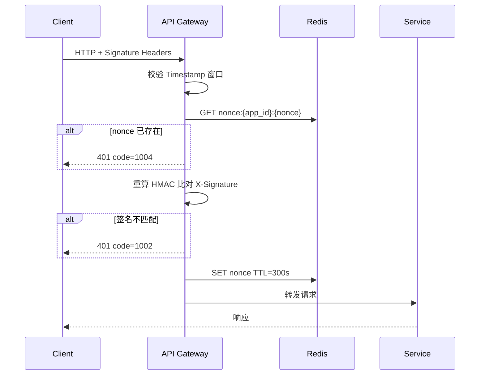

# HTTP 请求签名校验

> 保证 HTTP 传输的**完整性**与**防篡改、防重放**。与 JWT 互补：JWT 标识身份，签名验证请求未被篡改且来源合法。  
> OpenAPI 契约见 [openapi.yaml](openapi.yaml)；总览见 [protocol.md](../protocol.md)。

---

## 1. 设计目标

| 目标 | 机制 |
| :--- | :--- |
| 完整性 | Body SHA256 纳入签名字符串 |
| 防篡改 | HMAC-SHA256，密钥不随请求传输 |
| 防重放 | 时间戳窗口 + Nonce 一次性（Redis） |
| 多端隔离 | 按 `X-App-Id` 分配独立 `app_secret` |

**适用：** 所有 `/v1/` HTTP 接口（含 `POST /v1/auth/login`）。  
**不适用：** WebSocket 帧（WS 使用 JWT + 连接层 TLS；见 [proto/README.md](../proto/README.md)）。

---

## 2. 请求头

| Header | 必填 | 说明 |
| :--- | :--- | :--- |
| `X-App-Id` | 是 | 客户端应用 ID，如 `cocos-android`、`wechat-minigame` |
| `X-Timestamp` | 是 | Unix 秒级时间戳（UTC） |
| `X-Nonce` | 是 | 随机 UUID，单次请求唯一 |
| `X-Content-SHA256` | 是 | 请求体 `SHA256` 十六进制小写；GET/无 Body 时为 `e3b0c44298fc1c149afbf4c8996fb92427ae41e4649b934ca495991b7852b855`（空串哈希） |
| `X-Signature` | 是 | HMAC-SHA256 十六进制小写 |
| `Authorization` | 条件 | 除 login/refresh 外必填 `Bearer {access_token}` |

---

## 3. 签名算法

### 3.1 密钥

| 项 | 说明 |
| :--- | :--- |
| `app_secret` | 按 `X-App-Id` 配置，服务端与客户端预置（客户端需混淆存储） |
| 轮换 | 支持 `app_secret` 双密钥（`v1`/`v2`），Login 响应可下发当前 `sign_key_version` |

### 3.2 规范字符串（Canonical String）

各字段以 `\n` 连接，**不含**尾部分隔符：

```
{HTTP_METHOD}
{REQUEST_PATH}
{CANONICAL_QUERY_STRING}
{X-Timestamp}
{X-Nonce}
{X-Content-SHA256}
{AUTHORIZATION_VALUE}
```

| 字段 | 规则 |
| :--- | :--- |
| `HTTP_METHOD` | 大写，如 `GET`、`POST` |
| `REQUEST_PATH` | 含 `/v1/` 前缀的路径，不含 host，如 `/v1/wallet/room-card` |
| `CANONICAL_QUERY_STRING` | Query 参数按 key 字典序 `key=urlencode(value)` 用 `&` 连接；无 query 则为空串 |
| `AUTHORIZATION_VALUE` | 完整 Header 值如 `Bearer eyJ...`；login/refresh 无 Token 时为空串 |

### 3.3 计算签名

```
signature = HMAC-SHA256(key=app_secret, message=canonical_string)
X-Signature = hex_lower(signature)
```

### 3.4 示例（POST 开房）

```
POST
/v1/rooms
(empty query)
1719980000
a1b2c3d4-e5f6-7890-abcd-ef1234567890
e3b0c442...（实际为 body 的 SHA256）
Bearer eyJhbGciOiJIUzI1NiIs...
```

---

## 4. 服务端校验流程



| 步骤 | 规则 |
| :--- | :--- |
| 时间戳 | `\|now - X-Timestamp\| ≤ 300` 秒，否则 `1003` |
| Nonce | Redis `nonce:{app_id}:{nonce}`，TTL 300s，重复则 `1004` |
| 签名 | 常量时间比较 `X-Signature`，失败 `1002` |
| Body | 读取 raw body 计算 SHA256，与 `X-Content-SHA256` 一致 |

校验在 **Gateway 中间件** 统一执行，业务 Handler 之前（见 [platform-architecture.md](../platform-architecture.md)）。

---

## 5. 客户端实现要点

| 项 | 说明 |
| :--- | :--- |
| 封装位置 | `ApiClient` 拦截器（见 [client-architecture.md](../client-architecture.md)） |
| Body 哈希 | 与发送字节完全一致（UTF-8 JSON，无多余空格） |
| 时钟 | 客户端 NTP 校准；偏差过大导致 `1003` |
| 密钥保护 | `app_secret` 不进日志；小游戏可用服务端下发短期 token 替代硬编码（Phase 2） |

---

## 6. 错误码

| code | HTTP | 含义 |
| :--- | :--- | :--- |
| 1002 | 401 | 签名校验失败 |
| 1003 | 401 | 时间戳过期 |
| 1004 | 401 | Nonce 重放 |

响应体仍使用 `ApiError`，`message` 可本地化，**不返回**签名计算细节。

---

## 7. OpenAPI 集成

公共 Header 参数定义见 [components/parameters.yaml](components/parameters.yaml)。  
需签名的接口在 `parameters` 中引用；login 无 Bearer 但仍需签名 Headers。

全局安全策略：

```yaml
security:
  - bearerAuth: []
    signatureAuth: []   # 文档化组合；实际以 Header 参数 + 中间件实现
```

---

## 8. 与 JWT 的关系

| 层 | 作用 |
| :--- | :--- |
| **HMAC 签名** | 请求完整、来源 App、防重放 |
| **JWT Bearer** | 用户身份与 Session（login 之后） |

两者同时生效：`login` 仅签名；其余接口签名 + JWT。

---

## 9. 相关文档

| 文档 | 内容 |
| :--- | :--- |
| [protocol.md](../protocol.md) | 协议总览 |
| [openapi/README.md](README.md) | OpenAPI 约定 |
| [platform-architecture.md](../platform-architecture.md) | Gateway 中间件 |
