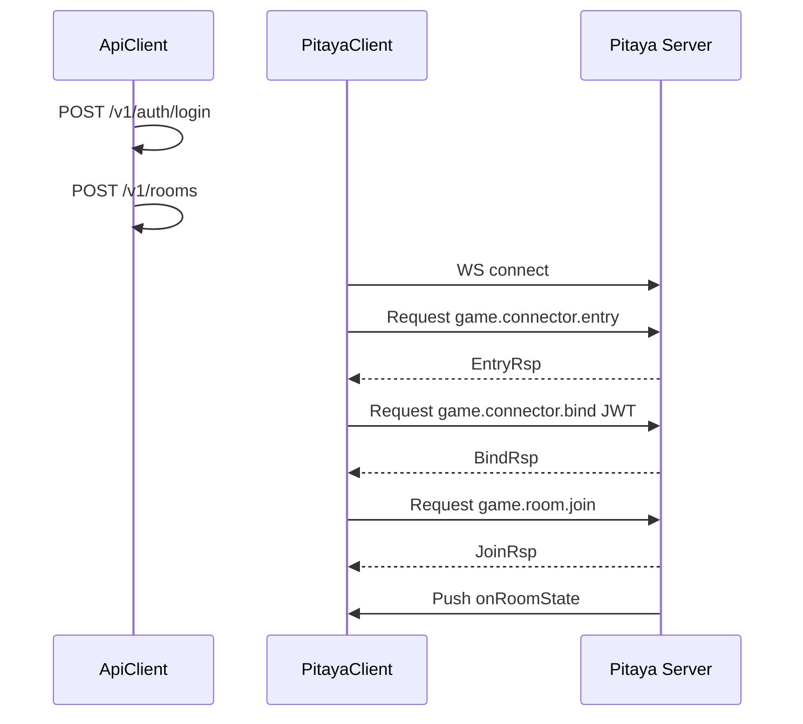

# Pitaya 客户端规范（Cocos Creator 3 + TypeScript）

> Cocos 侧自研 **PitayaClient**，对齐 [Pitaya](https://github.com/topfreegames/pitaya) 报文格式 + Protobuf 序列化。  
> 服务端见 [ADR-004](adr/004-pitaya-game-framework.md)；Proto 见 [proto/pitaya/](proto/pitaya/README.md)。

---

## 1. 职责

| 模块 | 职责 |
| :--- | :--- |
| `PitayaClient` | WS 连接、报文编解码、request/response、push 订阅 |
| `ApiClient` | HTTP OpenAPI（登录、开房），见 [client-architecture.md](client-architecture.md) |

**官方无 Cocos/TS SDK**，本项目自研；App 原生可选 [libpitaya](https://github.com/topfreegames/libpitaya)（与 TS 双轨，Phase 2）。

---

## 2. 连接流程



---

## 3. Pitaya 报文格式

WebSocket **binary**，`binaryType = 'arraybuffer'`。

Pitaya 包结构（与官方一致，文档级）：

| 字段 | 说明 |
| :--- | :--- |
| type | 包类型：Request / Response / Push / Notify |
| id | 请求 ID（Request/Response 配对） |
| route | 路由字符串，如 `game.dawugui.playcards` |
| data | Protobuf 序列化 body |

客户端实现需对齐 Pitaya 官方 packet 编解码（参考 pitaya 源码 `conn/message/message.go` 与 serializer）。

---

## 4. API 设计（TS 伪接口）

```typescript
class PitayaClient {
  connect(wsUrl: string): Promise<void>;
  disconnect(): void;

  request<TReq, TRsp>(route: string, req: TReq): Promise<TRsp>;
  notify(route: string, msg: object): void;

  onPush(route: string, handler: (msg: Uint8Array) => void): void;
  offPush(route: string): void;
}
```

| 方法 | 用途 |
| :--- | :--- |
| `request` | C2S Request/Response（playcards、join） |
| `notify` | 无响应通知 |
| `onPush` | 订阅 `onDeal`、`onSettlement` 等 |

---

## 5. Protobuf

- 生成：`ts-proto` 或 `protobufjs`，源文件 [proto/pitaya/*.proto](proto/pitaya/)
- 目录：`client/assets/platform/generated/pitaya/`
- Request：`PlayCardsReq` encode → Pitaya packet data
- Push：decode `DealPush` 等，**必读 `header.meta.audit_sn` 与 `action_seq`**

---

## 6. Push 订阅表

| Route | Proto | UI |
| :--- | :--- | :--- |
| `onRoomState` | RoomStatePush | 房间 UI |
| `onDeal` | DealPush | 发牌 |
| `onTurnNotify` | TurnNotifyPush | 倒计时 |
| `onPlayResult` | PlayResultPush | 出牌动画 |
| `onAlert` | AlertPush | 强制报单 |
| `onRoundInvalid` | RoundInvalidPush | 无效局 |
| `onSettlement` | SettlementPush | 结算 |
| `onError` | ErrorPush | 错误提示 |

---

## 7. 与 HTTP 协作

| 数据 | 来源 |
| :--- | :--- |
| JWT | ApiClient login |
| ws_url | CreateRoomResponse |
| room_id | join 请求参数 |
| 房卡/龟币余额 | HTTP 轮询或 Push 外 HTTP 刷新 |

---

## 8. 断线重连与 catch-up

| 场景 | 行为 |
| :--- | :--- |
| WS 断开 | 指数退避重连；重连后 bind + join |
| 错过 Push | `request('game.room.sync', { room_id, round_id, since_action_seq })` |
| seq 连续性 | 本地维护 `lastActionSeq`；收到 Push 时校验 `meta.action_seq === last + 1`，gap 则 sync |
| Push onError | 展示 message；`ref_audit_sn` 关联原操作 |

### EventMeta 本地状态

```typescript
interface EventTracker {
  roundId: string;
  lastActionSeq: number;
  onPush(meta: EventMeta): void {
    if (meta.action_seq !== this.lastActionSeq + 1 && this.lastActionSeq > 0) {
      this.sync(meta.room_id, meta.round_id, this.lastActionSeq);
    }
    this.lastActionSeq = meta.action_seq;
  }
}
```

---

## 9. 战绩回放（ReplayPlayer）

| 步骤 | 说明 |
| :--- | :--- |
| 1 | `ApiClient GET /v1/users/me/matches` 拉战绩 |
| 2 | 选局 → `GET /v1/rounds/{round_id}/replay` |
| 3 | 按 `events[].action_seq` 顺序 `applyEventToUI()` |
| 4 | 复用 live `onPush` handler（同一 proto） |
| 5 | 控制：暂停 / 1x·2x·4x / slider 跳步 |

整房串联：`GET /v1/rooms/{room_id}/replay` → 按 `round_no` 切换局。

局后回放含 `final_hands`（全员手牌）；进行中 sync 仍掩码他人手牌。

详见 [replay.md](replay.md)、[client-architecture.md](client-architecture.md) §Replay。

---

## 10. 错误与超时

| 场景 | 行为 |
| :--- | :--- |
| Request 超时 | 默认 10s；可配置 |
| replay 404 | 局未结束或已过期（见 retention） |

---

## 11. 目录

```
client/assets/platform/
├── sdk/
│   ├── PitayaClient.ts
│   ├── PitayaPacket.ts      # 报文编解码
│   ├── EventTracker.ts      # action_seq 跟踪
│   ├── ReplayPlayer.ts      # 战绩回放
│   └── ApiClient.ts
└── generated/pitaya/        # protoc/ts-proto 输出
```

---

## 12. 相关文档

| 文档 | 内容 |
| :--- | :--- |
| [replay.md](replay.md) | HTTP 回放 API |
| [audit-action-log.md](audit-action-log.md) | 有序日志 |
| [proto/pitaya/README.md](proto/pitaya/README.md) | Route proto |
| [protocol.md](protocol.md) | 双通道总览 |
| [client-architecture.md](client-architecture.md) | 客户端分层 |
