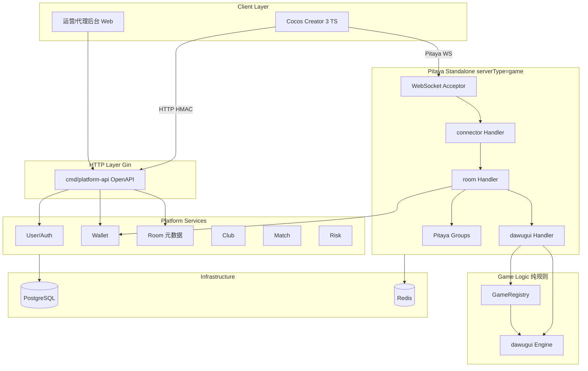

# Go 平台架构

> 技术层 — 服务端总体设计。**游戏实时层采用 [Pitaya](https://github.com/topfreegames/pitaya) Standalone**。  
> ADR：[adr/001-server-stack.md](adr/001-server-stack.md)、[adr/004-pitaya-game-framework.md](adr/004-pitaya-game-framework.md)

---

## 1. 总体分层



**职责边界：**

| 层 | 职责 |
| :--- | :--- |
| **Gin HTTP** | 登录、钱包、开房、俱乐部；OpenAPI + HMAC + JWT |
| **Pitaya** | WS 连接、Session、Handler、Groups、Push、Pipeline |
| **Platform** | 业务服务、PG 持久化、audit_sn |
| **GameEngine** | 纯规则，无 Pitaya/HTTP import |
| **Infra** | PostgreSQL、Redis |

---

## 2. 服务模块

MVP：**两进程**（可同机部署）。

| 包/进程 | 职责 | 对应运营 |
| :--- | :--- | :--- |
| `cmd/platform-api` | Gin REST（OpenAPI 3.0） | ops/room-card |
| `cmd/game` | Pitaya Standalone + Handlers | — |
| `internal/platform/*` | user、wallet、room、club、match、risk | 各 ops 模块 |
| `internal/pitaya/handlers/*` | connector、room、dawugui 薄层 | — |
| `internal/game/engine` | GameEngine interface | — |
| `internal/game/dawugui` | 打乌龟规则 | dawugui.md |
| `internal/game/registry.go` | game_id 注册 | games/README |
| `internal/audit` | Snowflake audit_sn | risk |

---

## 3. 技术选型

| 项 | 选型 |
| :--- | :--- |
| 语言 | Go 1.22+ |
| HTTP | **Gin** + OpenAPI 3.0 + oapi-codegen |
| HTTP 签名 | HMAC-SHA256（[http-signature.md](openapi/http-signature.md)） |
| **游戏实时** | **Pitaya v2 Standalone** |
| Pitaya 序列化 | Protobuf |
| Pitaya 传输 | WebSocket Acceptor |
| PG | PostgreSQL 16+，pgx v5 + **sqlx** |
| 缓存 | Redis（Nonce、room 摘要） |
| 配置 | Viper + ops-hooks JSONB |
| 日志 | slog |

### 3.1 HTTP 签名（Gin 中间件）

JWT 校验之前：Timestamp → Nonce → HMAC → Body SHA256。详见 [openapi/http-signature.md](openapi/http-signature.md)。

### 3.2 多游戏扩展约束

- `internal/platform` **禁止** import 具体游戏包
- 增游戏：Handler + Engine + proto/pitaya + ops-hooks
- 详见 [adr/002-pluggable-game-constraints.md](adr/002-pluggable-game-constraints.md)

### 3.3 工具链

| 工具 | 用途 |
| :--- | :--- |
| oapi-codegen | Gin Handler 生成 |
| buf | pitaya proto lint/generate |
| golang-migrate | PG 迁移 |

---

## 4. PostgreSQL / Redis

牌局热态在 Pitaya Handler 内存 + Redis 摘要；**局内每条逻辑事件** append-only 写入 PG。

### 4.1 核心表

| 表 | 说明 | 专篇 |
| :--- | :--- | :--- |
| `game_round` | 局元数据、配置快照 | [audit-action-log.md](audit-action-log.md) |
| `game_action_log` | 局内有序事件（`action_seq` + `audit_sn`） | 同上 |
| `room_event_log` | 房间生命周期（`room_seq`） | 同上 |
| `settlement_record` | 结算记录 | 同上 |
| `wallet_*` + `wallet_ledger` | 钱包，同事务 audit_sn | — |

### 4.2 回放读路径

| 场景 | 通道 |
| :--- | :--- |
| 局后战绩回放 | HTTP `GET /v1/rounds/{round_id}/replay` |
| 整房串联 | HTTP `GET /v1/rooms/{room_id}/replay` |
| 断线补发 | Pitaya `game.room.sync` |

详见 [replay.md](replay.md)。

---

## 5. 钱包模型

```
wallet_room_card        -- 平台级
wallet_game_coin        -- (user_id, game_id)
wallet_ledger
game_action_log
settlement_record
room_event_log
```

房卡开房走 **HTTP**；记分场结算由 **Pitaya Handler** 调 WalletService。

---

## 6. 房间双模式

| 字段 | 房卡场 | 记分场 |
| :--- | :--- | :--- |
| `room_mode` | room_card | score_field |
| 开房 | HTTP 扣房卡 | HTTP 匹配 |
| 对局 | Pitaya Group | Pitaya Group |
| 结算 | Push onSettlement，无抽水 | 抽水 5% |

---

## 7. 审计 audit_sn 与 action_seq

| 场景 | 标识 |
| :--- | :--- |
| Pitaya Push | `PushHeader.meta`（audit_sn + action_seq） |
| game_action_log | 同源，一 event 一 log |
| room_event_log | audit_sn + room_seq |
| HTTP 敏感写 | 响应 / ApiError 可选 audit_sn |
| 回放 API | events[].action_seq 有序返回 |

ADR：[005-ordered-action-log-replay.md](adr/005-ordered-action-log-replay.md)

---

## 8. 部署阶段

| 阶段 | 拓扑 |
| :--- | :--- |
| MVP | Gin + Pitaya Standalone 同机 |
| 成长期 | Pitaya **Cluster**：connector Frontend + game Backend + NATS + etcd |
| 成熟期 | 多 connector + PG 主从 |

---

## 9. MVP 优先级

| 优先级 | 模块 |
| :--- | :--- |
| P0 | User + Wallet + HTTP 开房 + Pitaya dawugui |
| P1 | Club API |
| P2 | Match + 记分场 + **战绩回放 HTTP** |
| P3 | Risk + Audit 后台 + admin audit API |

---

## 10. 相关文档

| 文档 | 内容 |
| :--- | :--- |
| [game-framework.md](game-framework.md) | Pitaya + GameEngine |
| [protocol.md](protocol.md) | HTTP + Pitaya |
| [pitaya-client.md](pitaya-client.md) | Cocos 客户端 |
| [adr/](adr/README.md) | 架构决策 |
