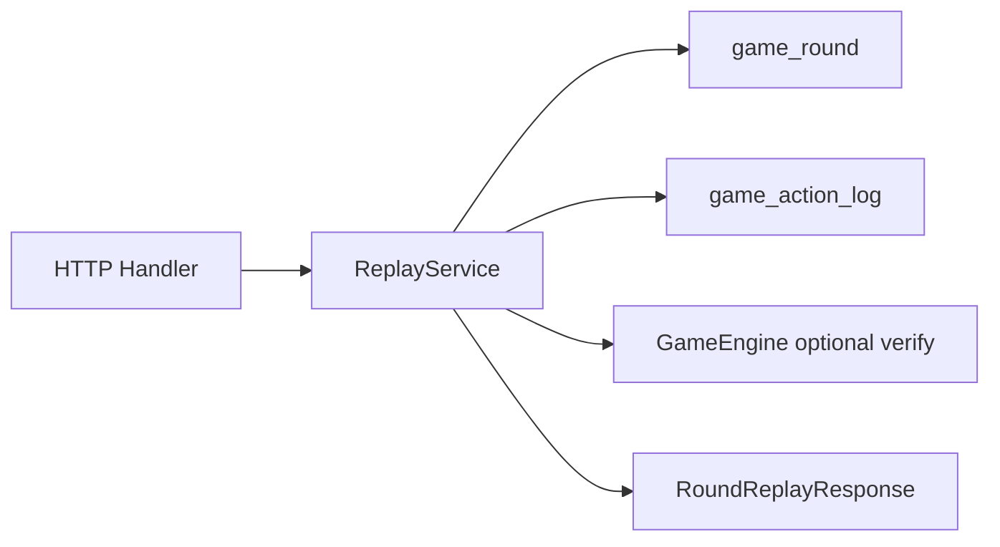

# 玩家回放（Replay）

> 技术层 — 局后战绩回放、整房串联、ReplayService 算法。  
> 数据模型见 [audit-action-log.md](audit-action-log.md)；ADR：[005-ordered-action-log-replay.md](adr/005-ordered-action-log-replay.md)

---

## 1. 回放模式

| 模式 | 入口 | 数据来源 | 手牌可见性 |
| :--- | :--- | :--- | :--- |
| **局后回放** | 战绩 → 单局 | HTTP `/v1/rounds/{round_id}/replay` | 局已结束，**全员完整手牌** |
| **整房串联** | 房间详情 → 整房回放 | HTTP `/v1/rooms/{room_id}/replay` | 每局独立，按 round 切换 |
| **断线补发** | WS 重连 | Pitaya `game.room.sync` | 进行中，`VisibleState` 掩码 |

---

## 2. ReplayService 算法



### 2.1 加载单局

1. `SELECT * FROM game_round WHERE round_id = ? AND status = 'ended'`
2. 校验请求用户为该局参与者（或管理员）
3. `SELECT * FROM game_action_log WHERE round_id = ? ORDER BY action_seq ASC`
4. 组装 `events[]`：每行 `{ action_seq, audit_sn, event_type, push_route, payload_base64 }`
5. 从 `SETTLEMENT` event 或 `SettlementEvent.final_hands` 提取 `final_hands[]`

### 2.2 确定性校验（可选）

```
state = Engine.NewState(round.config_snapshot, players)
for event in events where event is actionable:
    state, _ = Engine.ApplyAction(state, eventToAction(event))
assert state.Hash() == stored_hash  // 文档级可选
```

### 2.3 整房串联

1. `SELECT * FROM game_round WHERE room_id = ? ORDER BY round_no ASC`
2. 每局返回摘要 + `event_count`；完整 events 按需 lazy 加载（`GET /v1/rounds/{id}/replay`）

---

## 3. HTTP API 概要

完整 OpenAPI 见 [openapi/paths/replay.yaml](openapi/paths/replay.yaml)。

| 方法 | 路径 | 说明 |
| :--- | :--- | :--- |
| GET | `/v1/users/me/matches` | 当前用户战绩列表（分页） |
| GET | `/v1/rounds/{round_id}/replay` | 单局完整回放 |
| GET | `/v1/rooms/{room_id}/replay` | 整房多局串联 |
| GET | `/v1/rounds/{round_id}/events` | 分页事件（运营/调试） |
| GET | `/v1/admin/audit/actions` | audit_sn / room_id 查询（P3） |

---

## 4. RoundReplayResponse 结构

| 字段 | 类型 | 说明 |
| :--- | :--- | :--- |
| `round` | RoundSummary | round_id, round_no, game_id, started_at, ended_at |
| `room_id` | string | |
| `players` | PlayerReplayInfo[] | user_id, seat, nickname |
| `events` | ActionLogEntry[] | 有序事件列表 |
| `final_hands` | FinalHand[] | 局末全员手牌（仅 status=ended） |
| `settlement` | SettlementSummary | 胜负、积分、龟币变动摘要 |

### ActionLogEntry

| 字段 | 说明 |
| :--- | :--- |
| `action_seq` | 局内序号 |
| `audit_sn` | 审计号 |
| `event_type` | DEAL / PLAY / PASS / … |
| `push_route` | 对应 Pitaya Push |
| `payload` | base64(proto GameEvent) |
| `server_ts` | ISO8601 |
| `actor_user_id` | 可选 |

---

## 5. 断线补发（Pitaya sync）

Route：`game.room.sync`

```
Client                          Server
  |-- SyncReq(room_id, round_id, since_action_seq) -->|
  |<-- SyncRsp(latest_action_seq, pushes[]) ----------|
```

- 客户端维护 `last_action_seq`；重连后若 `last_seq < latest`，调用 sync
- `pushes[]` 为已含 EventMeta 的 Push proto bytes
- **不返回**他人未公开手牌（DealEvent 按 seat 掩码）

---

## 6. 客户端 ReplayPlayer

详见 [pitaya-client.md](pitaya-client.md) §9、[client-architecture.md](client-architecture.md)。

- 拉 HTTP replay → 按 `action_seq` 逐步 `applyEventToUI()`
- 复用 live Push handler（同一 proto）
- 控制：暂停 / 1x·2x·4x / 跳步（slider 绑定 action_seq）

---

## 7. 权限

| 角色 | 局后 replay | 整房 replay | admin audit |
| :--- | :--- | :--- | :--- |
| 局内玩家 | ✓ | ✓（曾参与该房） | — |
| 非参与者 | ✗ | ✗ | — |
| 运营后台 | ✓ | ✓ | ✓（P3） |

---

## 8. 相关文档

| 文档 | 内容 |
| :--- | :--- |
| [audit-action-log.md](audit-action-log.md) | 表结构与写入 |
| [openapi/paths/replay.yaml](openapi/paths/replay.yaml) | OpenAPI |
| [ops/shared/replay-ops.md](../ops/shared/replay-ops.md) | 运营 SOP |
