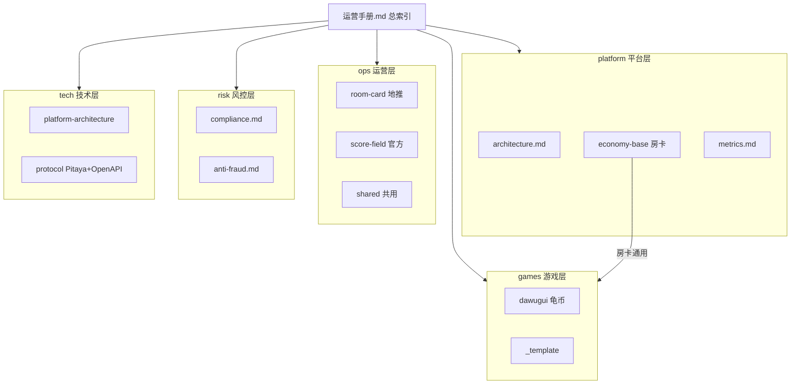
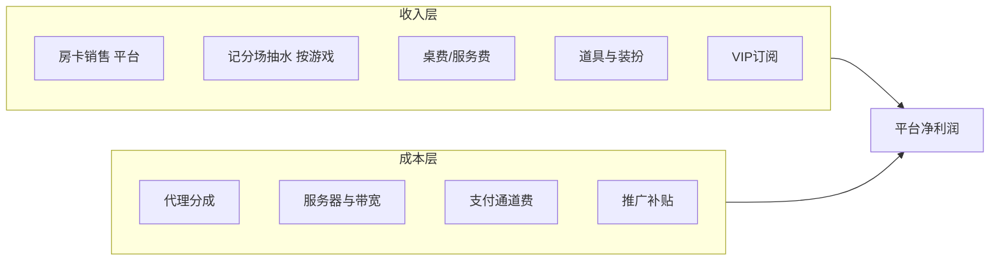

# 《打乌龟》平台运营手册 V2.1（总索引）

> 模块化运营文档体系入口。仅 Markdown 文档，无代码实现。  
> 游戏规则 PRD：[dawugui.md](dawugui.md)

---

## 文档说明

| 项目 | 说明 |
| :--- | :--- |
| **适用对象** | 运营团队、代理渠道、俱乐部管理员、产品经理 |
| **商业模式** | 房卡场（地推）+ 记分场（官方）双轨并行 |
| **版本** | V2.1（货币绑定模型：房卡=平台，游戏金币=游戏） |

**标注说明：**
- 【运营动作】— 运营团队可直接执行的事项
- 【产品需求】— 需产品/技术配合实现的功能，文档仅描述业务要求

---

## 货币绑定模型

| 货币 | 绑定 | 说明 |
| :--- | :--- | :--- |
| **房卡** | 平台 | 全游戏通用；各游戏房间可配置不同消耗数量 |
| **游戏金币** | 游戏 | 各游戏独立币种（如龟币）；记分场仅用本游戏金币 |

详见 [platform/economy-base.md](docs/platform/economy-base.md)、[games/dawugui/ops-hooks.md](docs/games/dawugui/ops-hooks.md)。

---

## 模块架构

**场域划分：**

| 场域 | 运营主体 | 消耗货币 | 文档入口 |
| :--- | :--- | :--- | :--- |
| **房卡场** | 地推 / 代理 / 俱乐部 | 平台房卡（通用） | [docs/ops/room-card/](docs/ops/room-card/overview.md) |
| **记分场** | 平台官方 | 各游戏独立金币 | [docs/ops/score-field/](docs/ops/score-field/overview.md) |

---

## 模块导航

### 平台层（房卡与平台 KPI）

| 文档 | 内容 |
| :--- | :--- |
| [architecture.md](docs/platform/architecture.md) | 四层架构、货币绑定、模块边界 |
| [economy-base.md](docs/platform/economy-base.md) | **平台房卡**定价、默认消耗、代理分成 |
| [metrics.md](docs/platform/metrics.md) | KPI、盈利测算、看板字段 |

### 运营层 — 房卡场（地推）

| 文档 | 内容 |
| :--- | :--- |
| [overview.md](docs/ops/room-card/overview.md) | 定位、Phase 1 目标、MVP 闭环 |
| [agent-club.md](docs/ops/room-card/agent-club.md) | 代理/俱乐部分成、KPI |
| [sop.md](docs/ops/room-card/sop.md) | 俱乐部孵化 SOP |
| [activities.md](docs/ops/room-card/activities.md) | 俱乐部榜、代理返利 |

### 运营层 — 记分场（官方）

| 文档 | 内容 |
| :--- | :--- |
| [overview.md](docs/ops/score-field/overview.md) | 官方定位、游戏金币隔离 |
| [tiers-rake.md](docs/ops/score-field/tiers-rake.md) | **抽水框架**（通用 5%） |
| [matching-bankruptcy.md](docs/ops/score-field/matching-bankruptcy.md) | 匹配、破产保护框架 |
| [activities.md](docs/ops/score-field/activities.md) | 签到、锦标赛（按游戏金币） |

### 运营层 — 共用

| 文档 | 内容 |
| :--- | :--- |
| [funnel.md](docs/ops/shared/funnel.md) | 新手转化漏斗 |
| [value-added.md](docs/ops/shared/value-added.md) | VIP、赛季通行证（Phase 3） |
| [replay-ops.md](docs/ops/shared/replay-ops.md) | **战绩回放、申诉 SOP** |
| [replay-retention.md](docs/ops/shared/replay-retention.md) | 对局日志保留策略 |

### 风控层（横切）

| 文档 | 内容 |
| :--- | :--- |
| [compliance.md](docs/risk/compliance.md) | 话术、房卡/游戏金币规则 |
| [anti-fraud.md](docs/risk/anti-fraud.md) | IP/GPS、异常输赢 |

### 游戏层（游戏金币 + 房卡消耗）

| 文档 | 内容 |
| :--- | :--- |
| [README.md](docs/games/README.md) | 新游戏接入指南 |
| [dawugui/ops-hooks.md](docs/games/dawugui/ops-hooks.md) | 打乌龟：**龟币**经济、房卡消耗、规则挂点 |
| [dawugui.md](dawugui.md) | 打乌龟规则 PRD |
| [_template/ops-hooks.template.md](docs/games/_template/ops-hooks.template.md) | 新游戏模板 |

### 技术层（Go + Pitaya + Cocos Creator 3）

| 文档 | 内容 |
| :--- | :--- |
| [tech/README.md](docs/tech/README.md) | 技术文档索引 |
| [adr/README.md](docs/tech/adr/README.md) | **架构决策（ADR）** |
| [platform-architecture.md](docs/tech/platform-architecture.md) | Gin 平台 + Pitaya 游戏层 |
| [game-framework.md](docs/tech/game-framework.md) | Pitaya Handler + GameEngine |
| [client-architecture.md](docs/tech/client-architecture.md) | Cocos + PitayaClient |
| [protocol.md](docs/tech/protocol.md) | HTTP OpenAPI + Pitaya WS |

### 运营后台（P1 已实现）

| 项 | 说明 |
| :--- | :--- |
| 代码目录 | [web/admin/](web/admin/) |
| 本地启动 | `make run-admin`（需先 `make run-api`） |
| 管理员账号 | 手机 `13800000000`，验证码见 `.env` 中 `DEV_SMS_CODE` |
| 能力 | 仪表盘 KPI、俱乐部/成员/房卡池、Mock 充值、ops-hooks 只读 |
| API 契约 | [docs/tech/openapi/](docs/tech/openapi/openapi.yaml) |
| [pitaya-client.md](docs/tech/pitaya-client.md) | Cocos PitayaClient 规范 |
| [audit-action-log.md](docs/tech/audit-action-log.md) | **有序动作日志 DDL** |
| [replay.md](docs/tech/replay.md) | **战绩回放 API** |
| [adr/005-ordered-action-log-replay.md](docs/tech/adr/005-ordered-action-log-replay.md) | 日志与回放 ADR |
| [openapi/](docs/tech/openapi/README.md) | HTTP API（OpenAPI 3.0.3） |
| [proto/pitaya/](docs/tech/proto/pitaya/README.md) | Pitaya Route Protobuf |

---

## 收入结构概览

---

## 如何新增游戏

1. 编写游戏规则 PRD（参考 [dawugui.md](dawugui.md)）
2. 复制 [ops-hooks 模板](docs/games/_template/ops-hooks.template.md) 并**必填游戏金币经济 + 房卡消耗**
3. 在本索引「游戏层」表格中注册
4. 房卡定价与代理分成**无需修改**（沿用 platform 层）

详见 [games/README.md](docs/games/README.md)。

---

## 术语表

| 术语 | 定义 |
| :--- | :--- |
| **房卡场** | 地推/代理运营的私密组局；消耗**平台通用房卡** |
| **记分场** | 平台官方匹配场域；消耗**该游戏独立金币**并抽水 |
| **房卡** | **平台绑定**，全游戏通用；仅用于开房，不可局内输赢 |
| **游戏金币** | **游戏绑定**，各游戏独立（如龟币）；不可跨游戏、不可提现 |
| **底分** | 记分场场次倍数，规则积分 × 底分 = 游戏金币变动 |
| **抽水** | 平台从赢家净赢中抽取 5%（全平台统一） |
| **报单 / 包牌 / 无效局** | 打乌龟特殊规则，见 [ops-hooks.md](docs/games/dawugui/ops-hooks.md) |
| **audit_sn（审计号）** | 全局唯一操作 ID；申诉与风控定位用 |
| **action_seq** | 局内事件序号；回放与断线补发用 |
| **战绩回放** | 局结束后查看完整对局过程，见 [replay-ops.md](docs/ops/shared/replay-ops.md) |

---

## 文档索引（原方案待办）

| 原方案待办 | 模块化文档 |
| :--- | :--- |
| economy-design | [economy-base.md](docs/platform/economy-base.md)（房卡）+ [dawugui/ops-hooks.md](docs/games/dawugui/ops-hooks.md)（龟币） |
| agent-system | [agent-club.md](docs/ops/room-card/agent-club.md) |
| room-card-mvp | [room-card/overview.md](docs/ops/room-card/overview.md) |
| game-features | [dawugui/ops-hooks.md](docs/games/dawugui/ops-hooks.md) |
| 记分场 | [score-field/](docs/ops/score-field/overview.md) + games 层金币 |
| risk-control | [risk/](docs/risk/compliance.md) |
| ops-activities | [room-card/activities.md](docs/ops/room-card/activities.md) + [score-field/activities.md](docs/ops/score-field/activities.md) |
| metrics-dashboard | [metrics.md](docs/platform/metrics.md) |

---

*总索引结束 — 详细内容请进入对应模块文档*
